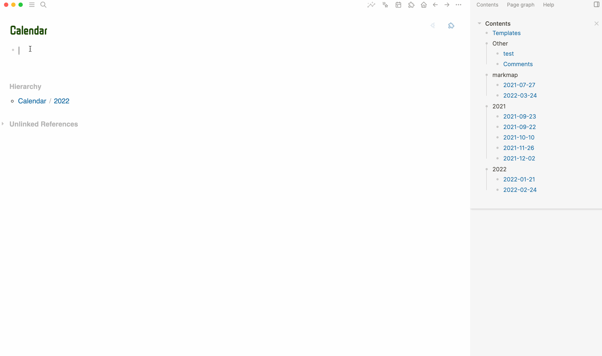

# Logseq Block Calendar

A plugin to render a calendar in block, so you can put it onto right side bar.

## Features

* Click date to jump to journal page.
* Switch month back and forth.
* Set back to today's month.
* Show if journal page exist by showing a red dot.
* Support setting first day of week.

## Usage

- Slash command `/Insert Block Calendar`  to insert a calendar
- `{{renderer block-calender:RandomID, [2022], [7], [en], [nohead|nonav]}}`
  - `[2022]`, `[7]`, `[en]` is optional.
  - Only support `zh-CN` and `en` language, PR is welcome.
  - `nohead` means do not have table head, so no month and year and month switcher.
  - `nonav` means still have month and year, but no month switcher.

## ❤️ Buy me a coffee

If you like this plugin and you will, you can choose to buy me a coffee via [this](https://www.buymeacoffee.com/vipzhicheng) and [this](https://afdian.net/@vipzhicheng), that means a lot to me.

## Licence
MIT
